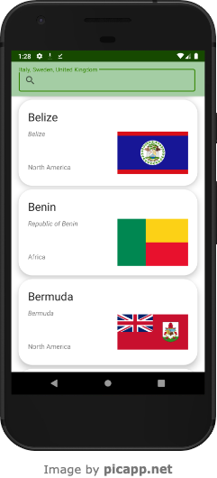

# RestCountriesApp

An application using RestCountries API v3.1  https://restcountries.com/#api-endpoints-v3-all

## Setup

This project doesn't need any particular setup process. 
It is enough to open the project in Android Studio (or any IDE you like) and get into the code!

## Views

This application shows first a loading screen.
Afterwards, the application moves you to the countries full list, where you can filter the countries you want.\
By clicking on a specific country, you move to the details of that specific country.

Loading screen:

Notifications of downloads:

List of countries:

Details of a country screen:

## Project structure

This project follows MVVM clean architecture principles and structure. It contains:

- A network layer
- A database layer (RoomDB)
- Repositories layer
- Views

This project uses _Hilt_ to inject necessary data as long as viewModels.\
This project uses _Android navigation library_ to define the navigation of the application.\
This project uses _safeArgs_ to pass data between navigation destinations.

## Data Logic

At the firstapp start, all countries information is downloaded from restcountries.com, and then saved as it is in the Room local DB.\
This allows the app also to work without an internet connection in the device.\
After downloading simple country data, the heavy logic of downloading flags and coats of arms is done by two subsequents WorkManagers.\
Image data is saved in the cache folder.